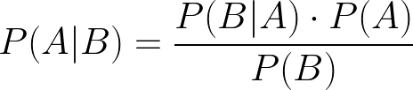

# Estudo de Machine Learning 

## SKlearn

1. Features
2. Targets
3. Training
4. Testing
5. Acuracy Rate
6. Optimize
7. Predict

## Support Vector Machine (SVM)
Studying the internal structure of these algorithms to comprehend why certain decisions are being made is not straightforward. Classification algorithms like the Support Vector Machine are challenging to study and interpret, which is why they are often referred to as "black boxes."

With SVC, after rescaling the data, the accuracy gains an impressive boost. However, i still haven't used a classification algorithm that provides us with its internal rules so that we can understand how certain decisions are made.

There are algorithms that display a sequence of decisions based on the provided data, such as a car having fewer miles driven and being newer, and how these decisions influence classification in a kind of "decision tree". Such classifiers are called decision tree classifiers. There are several algorithms of this type, i will use the default DecisionTreeClassifier from SKLearn.

Quantitative: represent numerical data.
Qualitative: represent data that express quality, opinion, or point of view.

Quantitative data can be classified into:

Discrete: represent a count in which the possible values form a finite or enumerable set. For example: number of children, quantity of courses taken, number of places visited.
Continuous: can take any value within a range of values. For example: height, time.

Qualitative data can be classified into:

Nominal: there is no inherent order among the categories. For example: gender, sick/healthy, eye color.
Ordinal: there is a specific order among the categories. For example: education level, social class.

## KNN K-Nearest Neighbors

1. Receive information
2. Calculate Distances
3. Order from the smallest distance to the largest
4. Perform class counting
5. Classify based on K-neighbors
6. Define Churn

#### Euclidean Distance
The most well-known and widely used distance measure is the Euclidean distance. It involves subtracting the coordinates of one observation from the other observation, squaring the results, summing all the values, and taking the square root.

#### Manhattan Distance
A distance that considers only the sum of the absolute differences between each pair of coordinates.

#### Minkowski Distance
A distance measure that generalizes other distances, such as Euclidean distance and Manhattan distance. It involves taking the absolute difference between each pair of coordinates, raising the result to the power of m, summing all the terms, and finally taking the m-th root, where m is any arbitrary number. Euclidean distance is a specific case when m is equal to 2, and Manhattan distance is a specific case when m is equal to 1.

#### Chebyshev Distance
It is a distance measure that considers only the maximum value among the absolute differences between variables. In this way, it takes into account only the variable that has the greatest difference in values between the two observations.
<<<<<<< HEAD

## Bayes' Theorem

Bayes' theorem is a formula used to calculate the probability of an event occurring, given that another event, called the conditioning event, has already occurred. This is known as conditional probability. Its notation is given by P(A|B), which represents the probability of event A given that event B has already occurred. It is defined by the following equation:

* P(B|A): probability of event B occurring given that event A has already occurred;
* P(A): probability of event A occurring;
* P(B): probability of event B occurring.
